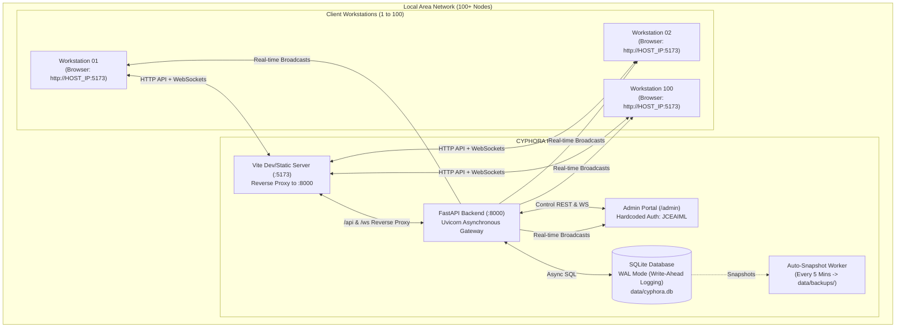

# ⚡ CYPHORA: Cyber Investigation & Multi-Modal Event Platform

[](https://fastapi.tiangolo.com)
[](https://react.dev)
[](https://vitejs.dev)
[](https://www.sqlite.org/wal.html)
[](https://developer.mozilla.org/en-US/docs/Web/API/WebSockets_API)
[](#scalability--concurrency-architecture)
[](#local-area-network-lan-deployment-100-nodes)

> **CYPHORA** is an immersive, high-concurrency symposium competition platform engineered for local-area networks (LAN). Participants step into the role of an investigator recovering corrupted expeditions, decrypting cyber signals in a simulated operating system, navigating multimodal visual evidence, and uncovering anomalous events.

Built from the ground up to support **100+ concurrent lab workstations** with zero cloud reliance, real-time WebSocket state synchronization, and an organizer command center.

---

## 📑 Table of Contents

- [Architectural Overview](#-architectural-overview)
- [Key Features](#-key-features)
- [The Competition Stages (Rounds)](#-the-competition-stages-rounds)
  - [Stage 1: OS Investigation & Cyber Forensics](#stage-1-os-investigation--cyber-forensics)
  - [Stage 2: Image Navigation & Multi-Modal Reconstruction](#stage-2-image-navigation--multi-modal-reconstruction)
  - [Stage 3: The Spire Anomaly (Platformer Engine)](#stage-3-the-spire-anomaly-platformer-engine)
- [Admin Portal & Command Center (`/admin`)](#-admin-portal--command-center-admin)
- [Scalability & Concurrency Architecture](#-scalability--concurrency-architecture)
- [Quick Start Guide](#-quick-start-guide)
  - [One-Click Windows Launcher](#1-one-click-windows-launcher-recommended)
  - [Manual Command-Line Launch](#2-manual-command-line-launch)
- [Local Area Network (LAN) Deployment (100+ Nodes)](#-local-area-network-lan-deployment-100-nodes)
- [API & WebSocket Reference](#-api--websocket-reference)
- [Directory Layout](#-directory-layout)
- [Disaster Recovery & Anti-Cheat](#-disaster-recovery--anti-cheat)

---

## 🏛 Architectural Overview



---

## ✨ Key Features

- **High-Concurrency SQLite WAL Engine**:
  Configured with `PRAGMA journal_mode=WAL`, `synchronous=NORMAL`, and custom connection busy timeouts (30s) to prevent lock contention across 100+ simultaneous workstation writes.
- **Bi-Directional WebSocket Hub (`/ws/live`)**:
  Push-based leaderboard broadcasts, live score increments, real-time timer sync, task completion pings, and explorer status updates (`active` vs `idle`).
- **Simulated Browser Desktop Environment (CYPHORA OS)**:
  A full retro-futuristic virtual desktop shell featuring draggable windows, audio spectrogram inspection, file comparison diffing, metadata analysis, radical converter utilities, and a virtual UNIX terminal.
- **Dual-Member Team Roster & Authentication**:
  Custom team registration capturing Team Name, Access PIN, Member 1, and Member 2, mapped automatically to workstation client IP addresses.
- **Master Admin Portal (`/admin`)**:
  Protected by credential `JCEAIML`. Includes live search, custom team notes, manual point adjustments with audit logging, event timer control, and CSV/JSON export.
- **Air-Gapped LAN Ready**:
  100% self-contained. Zero external CDNs or external APIs required during live tournament execution.

---

## 🎮 The Competition Stages (Rounds)

### Stage 1: OS Investigation & Cyber Forensics

Participants are placed in the **CYPHORA Virtual Operating System** to investigate corrupted fragments, audio logs, and hidden communications.

#### Integrated OS Applications
| Application | Purpose | Features |
| :--- | :--- | :--- |
| **Terminal** | Forensic shell | Commands: `ls`, `cat`, `cd`, `grep`, `diff`, `stat`, `chmod`, `decode`, `pwd`, `clear` |
| **File Manager** | VFS Navigator | Hierarchical directory tree, permissions inspector, file properties |
| **Audio Inspector** | Signal Analyzer | Waveform visualization, frequency spectrogram, audio playback |
| **Image Inspector** | Evidence Viewer | Deep zoom, pan, forensic channel extraction, metadata inspection |
| **File Comparator** | Diff Utility | Side-by-side text diffing for detecting corrupted lines and hash deltas |
| **Metadata Inspector**| Forensic EXIF | EXIF tags, creation stamps, author pointers, hidden offsets |
| **Converter** | Cryptographic Tool | Hex, ASCII, Binary, Base64, and Radix conversions |

#### 12 Investigation Tasks Catalog
Stage 1 contains 12 auto-evaluated tasks spanning 4 escalating difficulty tiers:

```
Tier 1: Basic Recovery
  ├─ Task 01: Encoded Message (50 pts)
  ├─ Task 02: File Information & Author Metadata (50 pts)
  └─ Task 03: Image Message & Sector Designation (50 pts)

Tier 2: System Reassembly
  ├─ Task 04: Ordering & Reasoning Classification (75 pts)
  ├─ Task 05: File Comparison & Checksum Diff (75 pts)
  └─ Task 06: The Fragmented Password Assembly (75 pts)

Tier 3: Network & Signal Correlation
  ├─ Task 07: Metadata Conversion & Pointer Tracking (100 pts)
  ├─ Task 08: Hidden Evidence & Frequency PIN (100 pts)
  └─ Task 09: Evidence Network Node Identification (100 pts)

Tier 4: Expert Synthesis
  ├─ Task 10: Multi-Stage Diff & Decode (150 pts)
  ├─ Task 11: Cross-Application Evidence Synthesis (150 pts)
  └─ Task 12: Final Boss — Trace the Memory Transfer (150 pts)
```

---

### Stage 2: Image Navigation & Multi-Modal Reconstruction

A multi-modal visual challenge where teams observe a protected target, compose detailed prompts, and iteratively recreate visual data.

1. **Narrative Briefing (Prologue)**:
   6 sequential cinematic story slides with voiceover transcripts and mission parameters before entering the arena.
2. **Protected Target Reference**:
   - Best-effort asset protection (disabled right-click, disabled image dragging, dynamic forensic watermark overlay displaying team name and timestamp).
   - Window blur detection when participants defocus the screen.
3. **Sequential 2-Phase Upload Workflow**:
   - **Phase 1 (Image 1 Draft)**: Upload initial synthesis draft for automated feature match evaluation (+200 pts baseline).
   - **Phase 2 (Image 2 Final)**: Unlocks the active second upload slot, triggering the speed-scoring engine.
4. **15-Minute Game HUD & Speed Scoring**:
   $$\text{Points Awarded} = 400\text{ (Base)} + \left( \frac{\text{Seconds Remaining}}{900} \times 600 \right)\text{ (Speed Bonus)}$$
   - Real-time countdown timer with urgency styling (`normal` $\rightarrow$ `warning` $\rightarrow$ `critical`).
   - Slide-out live standings drawer (`LeaderboardPanel`) without navigating away from the challenge.

---

### Stage 3: The Spire Anomaly (Platformer Engine)

A custom TypeScript/HTML5 Canvas physics engine (`round3/`) representing the Spire expedition field site:
- Dynamic obstacle courses, collapsing bridges, spikes, and energy fields.
- Tilemap terrain rendering with custom character sprite states (running, jumping, impact, air landing).
- Can be launched independently on LAN via `round3/host-round3-lan.bat`.

---

## 🛡 Admin Portal & Command Center (`/admin`)

The master management dashboard accessible at `http://<HOST_IP>:5173/admin` or `http://<HOST_IP>:8000/admin`.

- **Access Key**: `JCEAIML`
- **Real-Time Leaderboard Matrix**:
  Displays Rank, Team Name, Member 1, Member 2, Score, Stage, Current Status (`active`/`idle`), Workstation IP, and Action buttons.
- **Search & Multi-Column Sorting**:
  Filter across 100+ teams by name, member, status, or stage. Sort ascending/descending by score, rank, or activity.
- **Point Adjustment & Scoring Audit**:
  Add or deduct arbitrary points from any team with a recorded reason (e.g., penalty for rule violation, manual bonus).
- **Team Notes & Tagging**:
  Leave operational notes on specific teams (e.g., "Hardware issue resolved at workstation 34").
- **Global Event Timer**:
  Start, pause, adjust, or reset the synchronized event clock for all connected participants simultaneously.
- **Export Engine**:
  Download instant full-audit CSV or JSON reports including all team submissions, timestamps, and IP addresses.
- **Live Database Snapshots**:
  Trigger instant SQLite backup snapshots or restore to a previous snapshot directly from the UI.

---

## ⚡ Scalability & Concurrency Architecture

To guarantee smooth operation under **100+ concurrent machines** communicating simultaneously:

1. **SQLite WAL (Write-Ahead Logging)**:
   ```sql
   PRAGMA journal_mode = WAL;
   PRAGMA synchronous = NORMAL;
   PRAGMA busy_timeout = 30000;
   PRAGMA cache_size = -64000; -- 64MB memory cache
   ```
   Readers do not block writers, and writers do not block readers.
2. **Connection Pooling & Asynchronous I/O**:
   Powered by `aiosqlite` and SQLAlchemy Async Engine with recycled session pools.
3. **Automated 5-Minute Hot Backups**:
   An asynchronous background worker creates non-blocking SQLite hot snapshots in `data/backups/cyphora_backup_YYYYMMDD_HHMMSS.db`.
4. **Resilient LAN Authentication Fallback**:
   Requests support standard JWT Bearer headers, with automatic fallback to `X-Team-Id` / `X-Team-Name` headers for workstations where cookies or local storage are sandboxed.

---

## 🚀 Quick Start Guide

### Prerequisites
- **Python**: Version 3.10, 3.11, 3.12, or 3.13 ([python.org](https://python.org)) — Ensure *"Add Python to PATH"* is checked during installation.
- **Node.js**: Version 18.x or 20.x+ ([nodejs.org](https://nodejs.org))

---

### 1. One-Click Windows Launcher *(Recommended)*

In the project root, simply double-click:
```cmd
start.bat
```
*(or run `start_cyphora.bat`)*

**What this script does automatically**:
1. Checks and verifies Python and Node.js in your system `PATH`.
2. Automatically executes `npm install` and `pip install -r backend/requirements.txt` if dependencies are missing.
3. Launches the **FastAPI Server** on port `8000` in its own titled console.
4. Launches the **Vite Frontend Server** on port `5173` in its own titled console.
5. Automatically opens your default browser to `http://localhost:5173`.
6. Prints local and LAN IP URLs for immediate distribution to participants.

---

### 2. Manual Command-Line Launch

If running on Linux/macOS or running components manually in separate terminals:

#### Terminal 1 — Backend Server
```bash
# Install Python dependencies
pip install -r backend/requirements.txt

# Start FastAPI server on 0.0.0.0:8000
python backend/run_server.py
```

#### Terminal 2 — Frontend Dev Server
```bash
# Install npm packages
npm install

# Start Vite with external network binding
npm run dev -- --host 0.0.0.0
```

#### Terminal 3 (Optional) — Round 3 Platformer
```bash
cd round3
npm install
npm run dev -- --host 0.0.0.0
```

---

## 🌐 Local Area Network (LAN) Deployment (100+ Nodes)

### 1. Identify Host Machine's LAN IP
When you launch `backend/run_server.py` or `start.bat`, the console automatically detects your network adapter's IPv4 address:
```
=================================================================
      CYPHORA LOCAL EVENT SERVER & DATABASE (100 NODES)
=================================================================
 [*] Localhost Access      : http://localhost:8000
 [*] LAN Workstations URL  : http://192.168.1.50:5173
 [*] Admin Portal URL      : http://192.168.1.50:5173/admin
 [*] Real-time WebSocket   : ws://192.168.1.50:5173/ws/live
=================================================================
```

### 2. Windows Firewall Configuration
Ensure the host machine allows inbound connections on ports **5173** and **8000**:
```powershell
# Run in Administrator PowerShell on the host machine:
New-NetFirewallRule -DisplayName "CYPHORA Frontend" -Direction Inbound -LocalPort 5173 -Protocol TCP -Action Allow
New-NetFirewallRule -DisplayName "CYPHORA Backend" -Direction Inbound -LocalPort 8000 -Protocol TCP -Action Allow
```

### 3. Participant Workstations
On any lab computer connected to the same Wi-Fi router or Ethernet switch, open Chrome/Edge and navigate to:
```
http://<HOST_LAN_IP>:5173
```
*Example: `http://192.168.1.50:5173`*

All API calls (`/api/*`) and WebSocket connections (`/ws/*`) are automatically reverse-proxied by Vite to the backend on port 8000.

---

## 🔌 API & WebSocket Reference

### Authentication Endpoints (`/api/auth`)
| Method | Endpoint | Description |
| :--- | :--- | :--- |
| `POST` | `/api/auth/register` | Register new team (`name`, `pin`, `member1`, `member2`). Returns JWT token. |
| `POST` | `/api/auth/login` | Authenticate existing team using name & PIN. |
| `POST` | `/api/auth/quick-join` | Seamless auto-login or register for fast workstation bootstrapping. |

### Teams & Standings (`/api/teams`)
| Method | Endpoint | Description |
| :--- | :--- | :--- |
| `GET` | `/api/teams/leaderboard` | Live ranked leaderboard array with scores and stages. |
| `GET` | `/api/teams/me` | Fetch authenticated team profile, rank, and active status. |
| `GET` | `/api/teams/stats` | Aggregated tournament statistics (total teams, active, avg score). |

### Stage 1 Forensics (`/api/stage1`)
| Method | Endpoint | Description |
| :--- | :--- | :--- |
| `GET` | `/api/stage1/tasks` | Catalog of all 12 tasks with points and descriptions. |
| `POST` | `/api/stage1/submit` | Submit an answer flag for task verification. Awards points on success. |
| `GET` | `/api/stage1/submissions` | Retrieve completed tasks and timestamps for the current team. |

### Stage 2 Visual Navigation (`/api/stage2`)
| Method | Endpoint | Description |
| :--- | :--- | :--- |
| `POST` | `/api/stage2/evaluate-image1` | Phase 1: Submit Image 1 draft for feature similarity scoring (+200 pts). |
| `POST` | `/api/stage2/submit` | Phase 2: Final submission with Image 2 and calculated speed bonus. |

### Event Administration (`/api/admin`) *(Header: `X-Admin-Password: JCEAIML`)*
| Method | Endpoint | Description |
| :--- | :--- | :--- |
| `POST` | `/api/admin/login` | Authenticate organizer with password `JCEAIML`. |
| `GET` | `/api/admin/dashboard` | Complete telemetry: all teams, audit logs, system status. |
| `POST` | `/api/admin/score` | Adjust points for a team with logged justification. |
| `POST` | `/api/admin/note` | Attach administrative memo to a team record. |
| `POST` | `/api/admin/timer` | Broadcast global timer command (`start`, `pause`, `reset`, `set`). |
| `GET` | `/api/admin/export/csv` | Download complete tournament standings in CSV format. |
| `GET` | `/api/admin/export/json` | Download full database dump in JSON format. |
| `POST` | `/api/admin/backup` | Trigger an immediate SQLite database snapshot. |

### WebSocket Protocol (`ws://<HOST>:8000/ws/live`)
- **Incoming from Server**:
  - `INITIAL_STATE`: Dispatched upon initial handshake with current standings and active timer.
  - `LEADERBOARD_UPDATE`: Broadcasted to all 100+ workstations whenever any score changes.
  - `TIMER_UPDATE`: Global event timer synchronization tick.
  - `TASK_SOLVED`: Notification of team completing a challenge milestone.
- **Outgoing from Client**:
  - `{"action": "identify", "team": "<TEAM_NAME>", "team_id": <ID>}`: Binds socket to workstation.
  - `{"action": "ping"}`: Heartbeat keeping network NAT mapping alive.

---

## 📂 Directory Layout

```
CYPHORA/
├── backend/                        # FastAPI + SQLite Backend
│   ├── app/
│   │   ├── routers/
│   │   │   ├── admin.py            # Admin portal endpoints & database exports
│   │   │   ├── auth.py             # Team registration & PIN authentication
│   │   │   ├── stage1.py           # 12 OS Investigation tasks & grading
│   │   │   ├── stage2.py           # Image navigation & speed bonus evaluation
│   │   │   └── teams.py            # Live team leaderboard & standings
│   │   ├── auth_utils.py           # JWT handling, Bcrypt PIN hashing
│   │   ├── config.py               # Paths, security keys, SQLite config
│   │   ├── database.py             # Async SQLAlchemy + SQLite WAL setup
│   │   ├── main.py                 # FastAPI application & WebSocket hub
│   │   ├── models.py               # SQLAlchemy ORM schemas
│   │   ├── schemas.py              # Pydantic request/response validation
│   │   └── websocket_manager.py    # Multi-client connection manager
│   ├── requirements.txt            # Python dependencies
│   └── run_server.py               # Backend startup script with LAN IP detector
│
├── src/                            # React 18 + Vite Frontend Application
│   ├── admin/                      # Organizer Admin Portal
│   │   ├── AdminPortal.jsx         # Live telemetry, timer control, team actions
│   │   └── AdminPortal.css
│   ├── os/                         # Stage 1 Virtual Operating System
│   │   ├── apps/                   # Terminal, Audio Inspector, Diff, Converter
│   │   ├── boot/                   # Cinematic CRT boot animation
│   │   ├── shell/                  # Desktop, taskbar, start menu, window manager
│   │   ├── vfs/                    # Virtual filesystem tree & file permissions
│   │   └── OSContainer.jsx
│   ├── round1/                     # Round 1 task engine & progress tracker
│   ├── round2/                     # Stage 2 Image Navigation Arena
│   │   ├── components/             # ProtectedImage, PromptSection, ResultImageUpload
│   │   ├── Round2Page.jsx          # Arena container with Prologue & HUD
│   │   └── Round2.css
│   ├── App.jsx                     # Landing page, eyelid animation, team sign-in
│   └── main.jsx                    # Root client router (/, /admin, /round2)
│
├── round3/                         # Stage 3 Spire Platformer Game
│   ├── src/game/GameScene.ts       # Physics engine, bridges, tiles, obstacle logic
│   └── host-round3-lan.bat         # Standalone Round 3 LAN launcher
│
├── data/                           # Runtime storage (Created automatically)
│   ├── cyphora.db                  # Primary SQLite WAL database
│   └── backups/                    # Rolling 5-minute database snapshots
│
├── public/                         # Static game assets, prologue scenes, targets
├── start.bat                       # Single-click launcher for frontend & backend
├── start_cyphora.bat               # Full launcher with dependency auto-checks
├── run_server.bat                  # Backend-only launcher
├── vite.config.js                  # Vite configuration & LAN proxy
└── package.json                    # Frontend dependencies
```

---

## 🔒 Disaster Recovery & Anti-Cheat

### Anti-Cheat Measures
1. **Defocus Blur**: Target reference images automatically blur whenever participant switches tabs or loses browser focus.
2. **Dynamic Forensic Watermark**: Semi-transparent, unselectable SVG watermark stamped with the team's registered name and workstation address overlaid directly on evidence assets.
3. **Context Menu & Drag Lock**: Right-click context menus, image selection, and drag-and-drop out of browser are completely disabled.
4. **Session Lock State**: If a participant attempts unauthorized OS bypasses, the workstation enters a lockdown state requiring an organizer reset.

### Disaster Recovery
- **Zero Data Loss on Crash**: SQLite Write-Ahead Logging commits transactions immediately to disk before returning HTTP success.
- **Rolling Snapshots**: Every 5 minutes, an automated snapshot is written to `data/backups/`.
- **Instant Restore**: In the event of catastrophic physical server reboot, launching `start.bat` immediately resumes state from the intact `data/cyphora.db`.

---

## 📜 License

Created for the **CYPHORA Tech Symposium**. All rights reserved by the organizing committee.